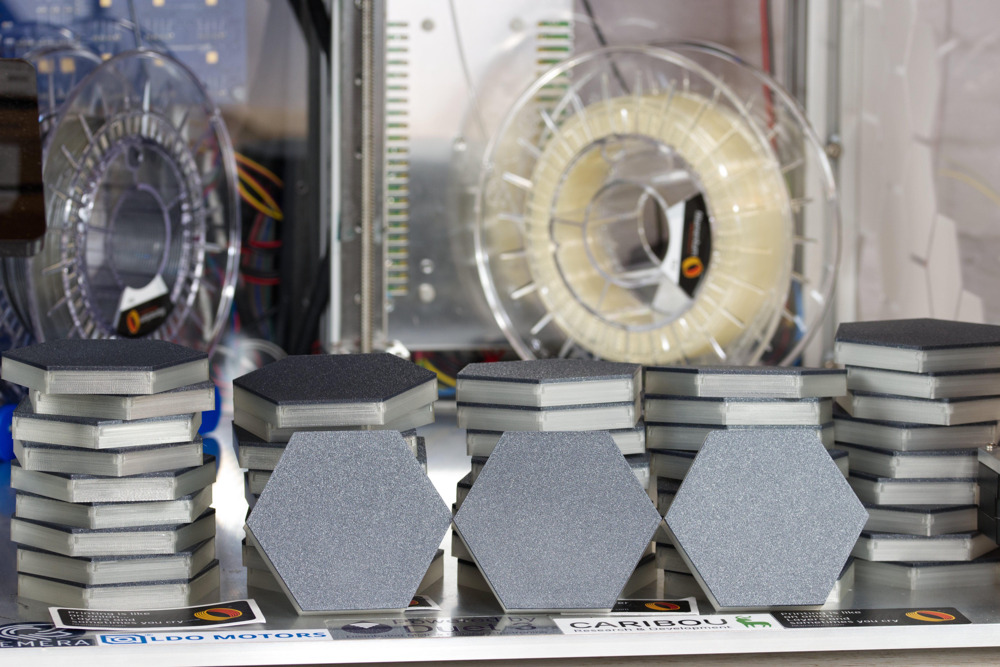

<h1 align="center"> Hexagon Desk </h1>
<h3 align="center"> Epoxy Coffe Table </h3>

 
  

<!-- TABLE OF CONTENTS -->
<h2 id="table-of-contents"> :book: Table of Contents</h2>

  
Table of Contents

  <ol>
    <li><a href="#about-the-project"> ➤ About The Project</a></li>
    <li><a href="#overview"> ➤ Overview</a></li>
    <li><a href="#project-files-description"> ➤ Project Files Description</a></li>
    <li><a href="#getting-started"> ➤ Getting Started</a></li>
    <li><a href="#PCB"> ➤ PCB: Main-PCB </a></li>
	<li><a href="#HexagonPCB"> ➤ PCB: HexagonPCB </a></li>
	<li><a href="#Links"> ➤ Useful Links: </a></li>
  </ol>

<!-- ABOUT THE PROJECT -->
<h2 id="about-the-project"> :pencil: About The Project</h2>

 
  I saw a short TikTok with a led table that lights up when touched and immediately felt like building it myself. So i designed my own Main-PCB and little hexagonal PCBs for the light and touch. Unfortunately, there were a few setbacks due to the availability of some components. So I had to equip the main PCB with self soldered components. I also had to get the touch sensors externally and solder them on. If the whole thing with the chips calms down a bit I will tackle the whole thing again and simplify it.

 
  

<!-- OVERVIEW -->
<h2 id="overview"> :cloud: Overview</h2>

 
  This project still requires a lot of manual work. The main board still has to be assembled by yourself, as well as the touch sensors on the Hexagon boards.
Also a lot of wiring has to be done. The touch sensors are individually connected to the main board. The WS2812B on the hexagons are looped through per channel.

 
  

<!-- PROJECT FILES DESCRIPTION -->
<h2 id="project-files-description"> :floppy_disk: Project Files Description</h2>

<ul>
  <li><b>Desk_PRG.ino</b> - Is the first version with an ESP32 as main controller</li>
  <li><b>Desk_PRG_RP2040.ino</b> - Is the current version with a RP2040 as controller.</li>
  <li><b>Adafruit_MCP23017.cpp/Adafruit_MCP23017.h</b> - Is for the MCP23017 I2C communication</li>
  <li><b>FastLED</b> - This is a modified Version of FastLED V3.4 to work with the RP2040</li>
</ul>

<!-- GETTING STARTED -->
<h2 id="getting-started"> :book: Getting Started</h2>

Install the RP2040 Board: https://github.com/earlephilhower/arduino-pico 

For ESP32 you have to install ESP32 Boards: https://randomnerdtutorials.com/installing-the-esp32-board-in-arduino-ide-windows-instructions/ 

For RP2040 You have to clone the repo and copy the FastLED folder in your "...\Dokuments\Arduino\libraries\" folder to work with the RP2040

Now you should be able to compile the

<pre><code>Desk_PRG_RP2040.ino</code></pre>

In the header you should config your Setup

Just configure the amount of Hexagon PCBs you have connectet to channel 0-3

<pre><code>#define Hexagons_channel_0  12</code></pre>
<pre><code>#define Hexagons_channel_1  12</code></pre>
<pre><code>#define Hexagons_channel_2  12</code></pre>
<pre><code>#define Hexagons_channel_3  14</code></pre>

In this config i have connectet 12 Hexagon PCBs to channel 0, 12 Hexagon PCBs to channel 1, 12 Hexagon PCBs to channel 2 and 14 Hexagon PCBs to channel 3. The desk was build with 50 Hexagon PCBs. The maximum is 64, but this can be expanded with more MCP23017.

<!-- Main-PCB -->
<h2 id="Main-PCB"> :small_orange_diamond: Main-PCB: What is the Main-PCB</h2>

 The Main-PCB contains 4x MCP23017, 2x 1500uF Capacitor, 1x Fuse holder, 1x SN74HC125N and one ESP32 Dev Kit C / Raspberry Pi Pico

The MCP23017 are communicating over I2C, every MCP23017 has 16 Inputs/Outputs.

The SN74HC125N is to shift the data channel from 3.3V to 5V so the leds don't glitch.

<!-- HexagonPCB -->
<h2 id="HexagonPCB"> :small_orange_diamond: HexagonPCB: The LED and Touch PCBs</h2>

I have designed this PCB to integrate the LEDs and the Touch Sensor.

The PCB has a "Data IN" and "Data OUT" so it is possible to connect multiple PCBs to act as a WS2812B Strip

Every PCB has a "Signal" Pin which connects the signal output from the TTP223 PCB to the Main-PCB

The Input Voltage is 5V for the PCB

I have scraped some varnish from the touch surface of the TTP223 sensors and soldered a cable there, which then functions as a touch sensor.

 
  

<!-- Links -->
<h2 id="Links"> :scroll: Some useful Links: </h2>

Schematic Wiring

[Wiring.pdf](https://github.com/mazls/hexagon-desk/files/8800328/Wiring.pdf)

Desk Cutout for 50 Hexagons

[Hex_Desk_Ausschnitt.pdf](https://github.com/mazls/hexagon-desk/blob/main/Hex_Desk_Ausschnitt.pdf)

Print files can be found here:

https://www.printables.com/model/200964-hexagon-led-coffee-table

 
  

Dev Kit link:

https://www.az-delivery.de/en/products/esp32-developmentboard

Videos

https://youtu.be/I4rWym8PK4s

https://www.youtube.com/watch?v=-OrUfqWGYhM&feature=emb_title

